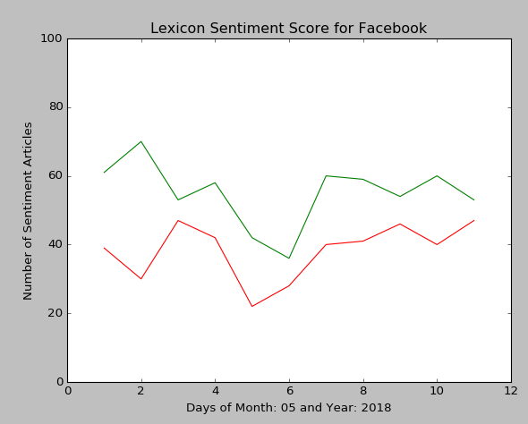
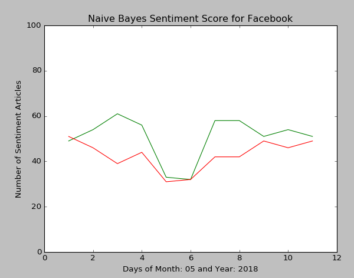
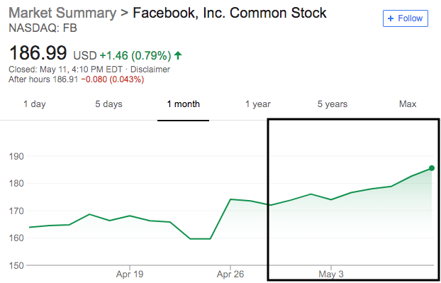

# Sentiment Analysis of Companies in the News

## Overview
### Author
* **Name**:   Joseph Young
* **NYU ID**: Jay283
* **Github**: joeyoung33333

### How to Run
1) Install all of the dependencies listed in Libraries, Data Sets, and Corpuses
2) Ensure file structure contains: Data_Sets (Training/Test Sets), Report, Scorers, Engine.py, Lexicon.py, Naive_Bayes.py, and NaiveBayesFreq,pkl
3) Open Engine.py in an IDE. Go to engine() function to change dates and company
4) Run on an IDE
5) Check Reports folder for outputs

### TL;DR
* **Algorithms**:      Lexicon-Based and Naïve-Bayes
* **Focus Companies**: Facebook, Amazon, Netflix and Google
* **Results**:         Lexicon-Based (64.408%) and Naïve-Bayes (83.292%)

### Newspapers, Magazines, and Sites
* **Business News**: Bloomberg, Business Insider, Fortune, The Economist, and The Wall Street Journal
* **General News**: ABC News, BBC News, CNN News, CBS News, NBC News, The New York Times, and The Washington Post
* **Technology News**: Engadget, Mashable, Recode, Tech Crunch, Tech Radar, The Verge, andWired

## Explanation
### Introduction and Description
This program tries to determine if an article has negative or positive sentiment from online business, technology,and general news sources (see full list above), and uses that information to predict and give insight into a technology company’s stock performance. This project focuses specifically on FANG (Facebook, Amazon, Netflix and Google) stocks because these companies frequently appear in the news. The purpose of the algorithm is to provide users a prediction and insight based off of sentiment from online news articles to gauge the position of a company's stock performance. Although there are many factors that need to be accounted for when trading stocks, much of the necessary information is reported in the news, and sentiment is able to be extracted from the articles to gauge feelings toward a company. Overall, the algorithm will be a tool used to aid in the buying and selling of a company’s shares by giving users informed data since it would be unlikely for them to read hundreds of articles a day on different companies and for them to try and gauge each article’s sentiment.

### Limitations
* Number of news articles released daily on any given company
* Speed at which an article is released
* Prices changing before an article is released
* Not everything is reported in the news
* There are many other factors other than news sentiment affecting stock prices
* Training sets used to train algorithms

### Implementation
**Stage 1**: The algorithm first imports all of the necessary data including a lexicon of positive and negative words from SentiWordNet (lexicon-based analysis), pre-trained file (Naïve Bayes analysis), and online articles from various sources. Then the data is cleaned, formatted, and stored.

**Stage 2**: The second stage then generates scores for each of the news articles. The Lexicon-Based method scores each individual word with a positive and negative score, then averages the scores for the entire article. The highest sentiment score is saved and assigned to the article. Next, the Naive-Bayes method iterates through the same set of articles, each word of the given article is given a score based on the frequency of the word in positive or negative corpuses trained from the IMDB Datasets. Here are the specific equations I used to calculate the scores for positive and negative scores for each word:

* Positive_Word_Score(Word) = ((POS_Freq(Word) / POS_Freq(All_Words) * (POS_Freq(All_Words) / POS_NEG_Freq(All_Words)) / ((POS_Freq(Word) + NEG_Freq(Word) / POS_NEG_Freq(All_Words)))

* Negative_Word_Score(Word) = ((NEG_Freq(Word) / NEG_Freq(All_Words) * (NEG_Freq(All_Words) / POS_NEG_Freq(All_Words)) / ((POS_Freq(Word) + NEG_Freq(Word) / POS_NEG_Freq(All_Words)))

The individual words scores are then aggregated and averaged for each article. A count is kept for the number of positive and number of negative articles for each day.

**Stage 3**: The third stage uses the previously generate sentiment scores to make a prediction of the stock market. By taking the number of negative and positive articles, the system will find the difference and generate a suggestion. When a certain sentiment of an article has a difference greater than 20% of the given articles, then the suggestion will move toward that direction (Example: 130 Positive Articles, 70 Negative articles, Stock Price will Increase). Also, the system will generate a report containing all of the given article sentiment counts for everyday that was specified. All of the articles used will also be output into the report folder. Graphs of the data will also be generated for the user displaying the change over time for sentiment scores.

## Sample Input and Outputs
**Single Article (Program Does Not Display)**
* Stripped Input: “say new feature will give user greater control data is share update including virtual reality and live chat social network report”
* Lexicon Output: {'POS': 0.06491741809767, 'NEG': 0.03026858269966}
* Naive Bayes Output: {'POS': 0.05193749421616, 'NEG': 0.04806250578383}

**All Articles (Generated in the Reports Folder)**
* Input: Around 100 Articles of a Company from Various New Sources
* Output for a Given Day: Company: Facebook, Month: 04, Day: 1, Year: 2018 Results: Positive Sentiment. Stock prices will increase. Lexicon - POS: 46, NEG: 43, NEUT: 0 Naive Bayes - POS: 47, NEG: 42, NEUT: 0

## Results
### Lexicon-Based Algorithm Results

**Lexicon-Based Approach: Testing on Annotated IMDB Corpuses (Testing Set)**
*  **Testing on Positive Corpuses**:
    * Number of Articles: 12,500
    * Positive  Articles:  8,396
    * Negative  Articles:  4,104
    * Neutral   Articles:      0
    * **Accuracy** = 8,396 / 12,500 = 67.168%

* **Testing on Negative Corpuses**:
    * Number of Articles: 12,500
    * Positive  Articles:  4,794
    * Negative  Articles:  7,709
    * Neutral   Articles:      0
    * **Accuracy** = 7,706 / 12,500 = 61.648%

**Naïve-Bayes Approach: Testing on Annotated IMDB Corpuses (Testing Set)**
* **Testing on Positive Corpuses**:
    * Number of Articles: 12,500
    * Positive  Articles: 10,150
    * Negative  Articles:  2,350
    * Neutral   Articles:      0
    * **Accuracy** = 10,150 / 12,500 = 81.2%

* **Testing on Negative Corpuses**:
    * Number of Articles: 12,500
    * Positive  Articles:  1,825
    * Negative  Articles: 10,673
    * Neutral   Articles:      2
    * **Accuracy** = 10,673 / 12,500 = 85.384%

The lexicon-based approach has an accuracy of (67.168 + 61.648) / 2 = 64.408% on 25,000 IMDB Corpuses. This means that the lexicon-based approach beats the 50% chance mark of a system that would randomly output a positive or negative classification. Marginal improvements were made to the score by taking negatition and word intensity into account, which increased the score by roughly 2% to 64.408%. Ultimately, finding ways to marginally increase the score was difficult, so the Naive-Bayes method was chosen as another system used in order to find a system with higher accuracy. Looking at the test results from the Naive-Bayes trials, the system received an accuracy of (81.2 + 85.384) / 2 = 83.292% on 25,000 IMDB corpuses. The system clearly out performs the lexicon-based approach and surpasses the chance of random outputs. While the Naive-Bayes system performs very well on classification of articles within a given category, it will most likely decrease in performance when tested on articles outside of movie reviews since it was not trained on that specific data. For that reason, the lexicon-based approach is a much less biased system as it was trained on an annotated dataset (SentiWordNet) with word scores produced by a system using a large and diverse data set.

### Reporting
A report is generated within the report folder containing all of the sentiment article counts, labeled <company searched>-report.txt. An organized output of all of the articles analyzed will also be generated in the report folder, labeled <company searched>-articles.txt. The company report will generate sentiment scores for every article from the start of the month to the given date, and output the number of positive and negative articles from each day using both the lexicon and Naive-Bayes approach. Graphs of each algorithm will also be generated to help visualize the data.

### Further Plans
While working further on this project, I would like to increase the Lexicon-Based approach by using a different annotated corpus, as SentiWordNet received rather low accuracy markings on other systems. I will still keep word negation and intensifiers as features, but an overall improved annotated corpus would greatly increase the accuracy. This can be seen in M. Taboada Et al.’s SO-CAL system, which achieved results in the 80% area using their own annotated words.
One addition I will add to the Naive-Bayes method is adding part of speech as a feature for predicting sentiment. Pang Et. al, had a slight increase in their score when using this extra feature and I would like to see if this would increase the accuracy of my current Naive-Bayes system. Another addition for the Naive-Bayes algorithm would be to find another large set of annotated data from varying news sources like the Wall Street Journal or Bloomberg to add on top of the current training. The current system has limitations because it has been training solely on IMDB movie reviews and there are still a handful of out of vocabulary words that are not scored, so a larger data set would greatly increase the accuracy.
Clearly, the one part of the system that still has work to be done is the stock prediction section which uses a simple method for deciding when a stock price will increase or decrease. Further on, I would like to create a data set of historical news articles with their positive and negative sentiment article count and the resulting percentage increase or decrease of a company’s stock price the same day, next day, and two days after. This would be a system that trains on individual companies, to produce predictions for that company. I would use a simple clustering algorithm like K-Means to group the results within a three dimensional graph using the number of positive articles, number of negative articles, and stock performance. K-Means would then form 3 cluster groups within the three dimensional graph for increase, decrease, and static stock changes which could then match the new results from the current day into one of the clusters.

## Libraries, Data Sets, and Corpuses

**Source**: [News API](https://newsapi.org/)

**Source**: [NLTK](https://www.nltk.org/)

**Source**: [MatPlotLib](https://matplotlib.org/)

**Source**: [Requests](http://docs.python-requests.org/en/master/)

**Source**: [Naive-Bayes Tutorial](https://www.analyticsvidhya.com/blog/2017/09/naive-bayes-explained/)

**Source**: [SentiWordNet 3.0 Data Set](http://sentiwordnet.isti.cnr.it/)

**Source**: [Stanford IMDB Data Set](http://ai.stanford.edu/~amaas/data/sentiment/)

**Note**: There are limitations when using a movie data set for training Naïve-Bayes and running the trained algorithm on a data set from a different category like business. Terms used in movies compared to business may have different sentiment like the word "balloon." "Balloon" in a movie may refer to a physical object with a rather objective meaning, while in business they may refer to a market bubble.

